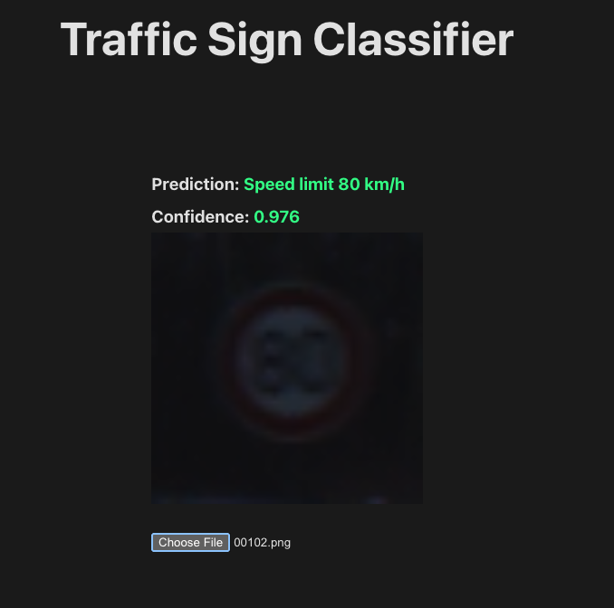

# 🛣️ Road Sign Classifier

A full-stack application that classifies German road signs using a deep learning model trained on the [GTSRB (German Traffic Sign Recognition Benchmark)](https://www.kaggle.com/datasets/meowmeowmeowmeowmeow/gtsrb-german-traffic-sign) dataset.

Users upload an image of a road sign via a **React + Vite + TypeScript** frontend. The image is sent to a **Python Flask** backend, which uses a **TensorFlow/Keras** model (`traffic_classifier.keras`) to return the predicted label and confidence score.

---

## 🚀 Technologies Used

### Frontend

- React
- Vite
- TypeScript

### Backend

- Python
- Flask
- TensorFlow
- Keras

---

## 🧠 Model

- File: `traffic_classifier.keras`
- Framework: TensorFlow/Keras
- Dataset: [GTSRB - German Traffic Sign](https://www.kaggle.com/datasets/meowmeowmeowmeowmeow/gtsrb-german-traffic-sign)
- Task: Classify 43 types of German road signs

---

## 📷 How It Works

1. User uploads a road sign image via the frontend.
2. The frontend sends a POST request to: http://127.0.0.1:8080/api/v1/image/classify

3. The backend:

- Loads the model (`traffic_classifier.keras`)
- Preprocesses the image
- Runs prediction
- Returns JSON like:

```json
{
  "imageName": "000.png",
  "predictedLabel": "Speed limit (30km/h)",
  "confidence": 0.93
}
```

## Sample Predictions

| Image                                        | Predicted Label      | Confidence |
| -------------------------------------------- | -------------------- | ---------- |
|  | Speed limit (80km/h) | 97.6%      |
|         | Stop                 | 98%        |
|      | No entry             | 95%        |

## ⚠️ Model Limitations

- Trained only on the GTSRB dataset; may not generalize to non-German or heavily altered signs.
- Sensitive to poor lighting, weather, rotation, and perspective distortions.
- Requires clear, high-resolution images; blurry or noisy images reduce accuracy.
- Always returns a prediction; low-confidence results should be interpreted cautiously.
- Assumes one centered sign per image; cannot handle multiple or partially visible signs.
- For demonstration only; not suitable for real-world safety-critical applications.
